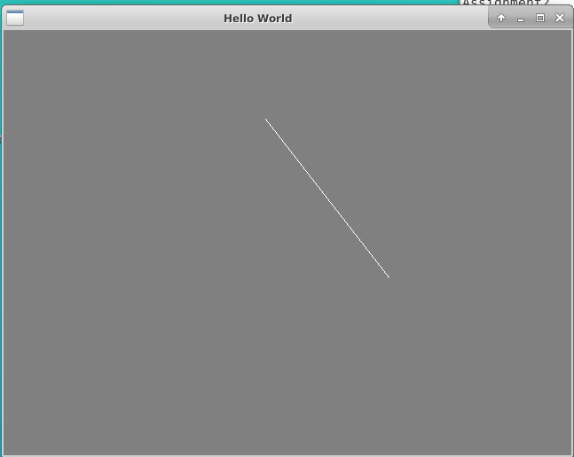
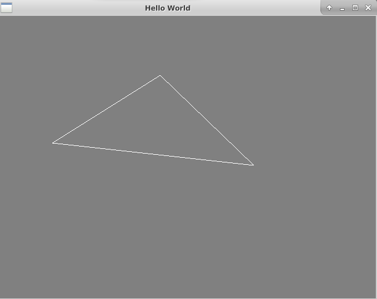
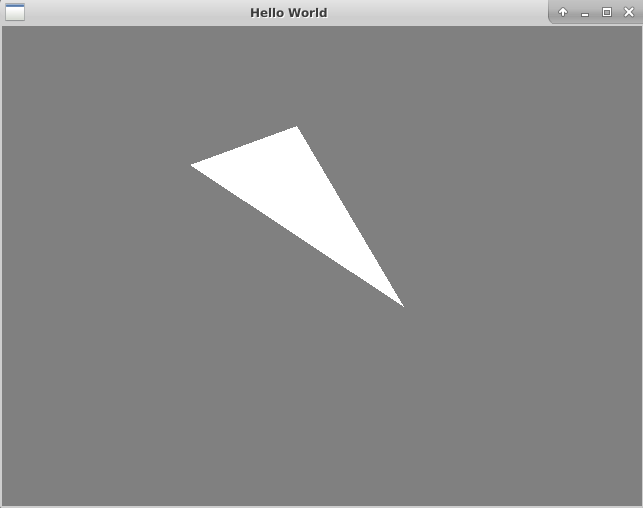
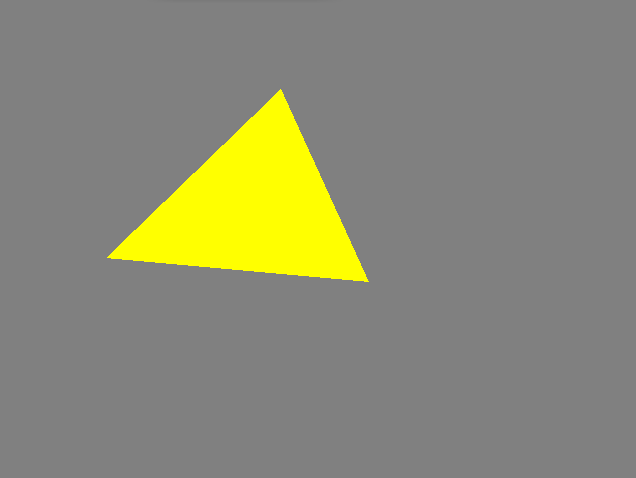
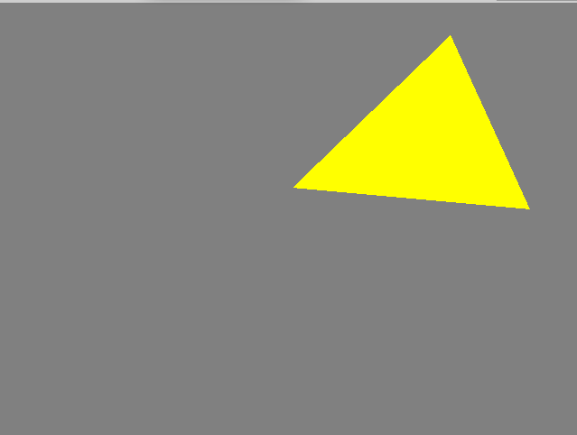
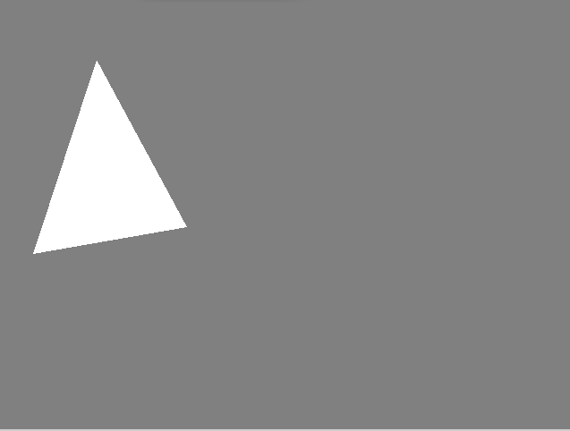
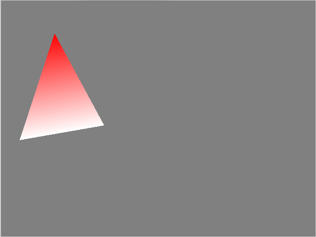
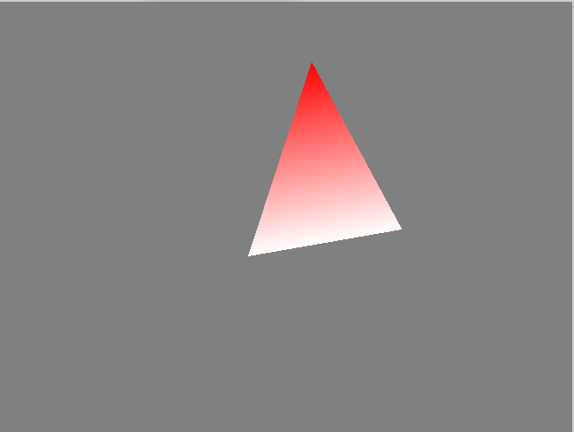
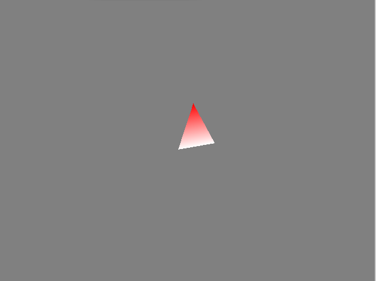
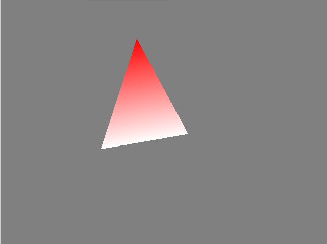

# Assignment-2-Triangle Editor and Rasterization
Author : Yichen Xie\
Date: Oct/14/2021

## Assignment Tasks
For the introduction to assignment tasks, see
[Assignment 2:2D Triangle Editor and Rasterization](https://github.com/nyu-cs-cy-6533-fall-2021/base/blob/main/Assignment_2/requirements/Assignment-2_2D_Editor.md)


## Installation
This project is built by CMAKE. Try:
```shell
> cd build
> cmake .
> make
```

## Result Generation
You can generate experiment results by running bin file in the project folder:
```shell
{PROJECT_DIR}/build/Assignment2_bin
{PROJECT_DIR}/build/Assignment2_extra_bin
```

## Result Illustration

### Inserting
By pressing 'i' button on the keyboard, you can activate the 'Insert Mode'.
Click your left mouse button and then move, you can see a preview line:


Then click your left mouse button for the second time, you can detemine this line as one edge of your triangle. Move your mouse again and you can see the 3 edges of the triangle.


Finally, by clicking your mouse for the 3rd time, you can get your own triangle on the screen!


### Transformations
Pressing 'o' button to activate the 'Transformation Mode'.

* Moving(Translations)
Press your mouse left-button on the triangle and then drag, you can see the triangle turns into yellow (which means it is selected) and the triangle moves to the new position of your mouse. This processing is real-time displayed, which means you can see the triangle moves along as your mouse moves.




* Rotating and Scaling
Click on the triangle you want to change, and then press the 'h' button to rotate it for 10 degrees clockwise, and 'j' for 10 degrees counter-clockwise.


Press 'k' to make it bigger for 20%, and 'l' for 20% smaller.

### Delete
Pressing 'p' button to activate the 'Delete Mode'.

First we create 2 triangles.


By click on triangle(the one on the right), you can remove it from the window.



### Color
Pressing 'c' button to activate the 'Color Mode'.

Cilck on the vertex you like, and then press number buttons (1~9), you can give the vertex a new color, and the color of the triangle is linear-interplorated.



### View Opreations

Pressing 'w' / 'a' / 's' / 'd' to move your camara up / left / down / right.



Pressing '+' to zoom in by 20%, '-' to zoom out by 20%.



### Animations
Pressing 'v' to activate 'Animation Mode'.

You can press 'k' or 'l' to see fancinating scaling operation with an animation!



## Extra Task
The transfromation functions are implemented in the a tranformation matrix which is sent to the shader directly to make GPU calculate the result. The translations are accumulated in ROTATE, TRANSLATION and SCALE matrix, and make a MODEL matrix where MODEL = TRANSLATION * ROTATE * SCALE. Then we make MODEL matrix as an uniform variable in the shader program, which can sent transformation information without changing the vertex array V.

For details you can see *src/extra.cpp*.